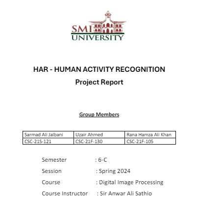

# Digital Image Processing - Semester Project

The semester project for the Digital Image Processing course focused on Human Activity Recognition was completed under the guidance of Professor <a href="https://github.com/Anwar-Ali-Sathio/">Mr. Anwar Ali Sathio</a>. The project involved developing advanced algorithms to analyze and interpret human activities from digital images, leveraging various image processing techniques to achieve accurate recognition. Professor Mr. Anwar Ali Sathio provided invaluable supervision and insights throughout the project, ensuring a thorough and effective approach to solving the challenges presented in human activity recognition.

## Project Partners Detail

